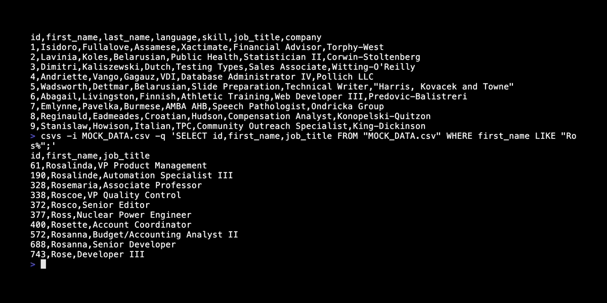
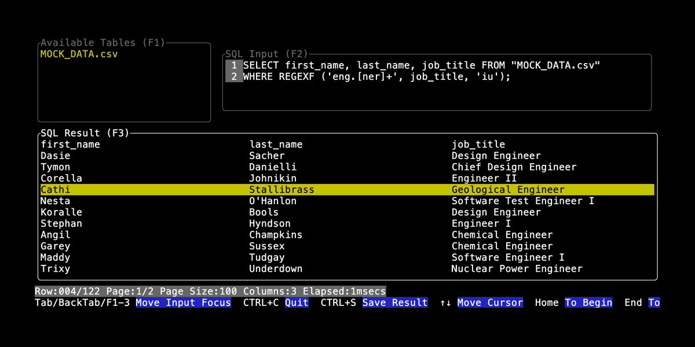

# csvs

**csvs** (**CSV** **S**ql) is a command-line tool designed to streamline SQL queries on CSV or TSV files using an
embedded [SQLite](https://www.sqlite.org/) engine. Whether you're a data analyst managing datasets or a developer
processing text-based data, **csvs** enhances your workflow with SQL's full capabilities.




- [Features](#features)
    - [SQL Power for CSV Files](#sql-power-for-csv-files)
    - [Automatic Encoding Detection](#automatic-encoding-detection)
    - [Multi-File Handling](#multi-file-handling)
    - [Customizable Output](#customizable-output)
    - [Interactive Mode](#interactive-mode)
    - [Multi-Statement Query Support](#multi-statement-query-support)
- [Usage](#usage)
    - [Interactive Mode](#interactive-mode-1)
    - [Command Options](#command-options)
- [Example](#example)
- [SQL Query Notes](#sql-query-notes)
    - [Mapping CSVs to Table Names](#mapping-csvs-to-table-names)
    - [Quoting Columns with Special Characters](#quoting-columns-with-special-characters)
    - [`--in-no-header` Option](#--in-no-header-option)
    - [Execute Multiple Statements in a Single Query](#execute-multiple-statements-in-a-single-query)
- [Error Handling](#error-handling)
- [Build](#building-csvs)
- [Limitations](#limitations)
- [Acknowledgments](#acknowledgments)
- [License](#license)

---

## Features

### SQL Power for CSV Files

Run powerful SQL queries like `JOIN`, `GROUP BY`, `SUM()`, or `COUNT()` on CSV data.
Query, filter, sort, group, and combine data more flexibly than traditional spreadsheet tools.

### Automatic Encoding Detection

No more guessing file encodings! **csvs** auto-detects character encodings, ensuring smooth processing without garbled
text or broken queries.

### Multi-File Handling

Easily join multiple files with `--in-file` to create a temporary SQLite database. Perform SQL joins across files in
seconds.

### Customizable Output

Export query results as:

- **CSV or TSV**: For sharing or downstream processing.
- **SQLite Database**: Keep results as `.db` files for later queries.

Customize delimiters, headers, and quoting styles for total control.

### Interactive Mode

Run **csvs** interactively when no query is provided. Explore data as SQLite tables, run ad-hoc queries, and preview
results.

### Multi-Statement Query Support

Execute multiple SQL statements in one command. Transform data across steps, with only the final result displayed.

---

## Usage

- Display help:

```shell
csvs --help
```

### Interactive Mode

- If neither `--query` nor` --source` is specified, **csvs** starts in *interactive mode*, allowing you to:
    - View and explore tables.
    - Preview table data.
    - Save query results to files.

See [Interactive Mode Guide](interactive_mode.md)


### Command Options

See [Command Options Guide](command_options.md)


---

## Example

- Display version:

```shell
csvs --version
```

- Select "city","town","phone" from `./data/address.csv` and save to `picked.csv`:

```shell
csvs -i ./data/address.csv -q 'SELECT "city","town","phone" FROM "address.csv"' -o picked.csv
```

- Read CSV data from `STDIN`:

```shell
csvs -q 'SELECT "city","town","phone" FROM "stdin"' < ./data/address.csv > picked.csv
```

or

```shell
cat ./data/address.csv | csvs -q 'SELECT "city","town","phone" FROM "stdin"' > picked.csv
```

- Select all fields from `./left.csv` joined with `./right.tsv` on a common field `name`. Multiple `--in-file` flags can
  be used to handle multiple input files in one command:

```shell
csvs -i ./left.csv -i ./right.tsv -q 'SELECT * FROM "left.csv" AS l JOIN "right.tsv" AS r ON l."name"=r."name"'
```

- Use standard SQLite functions (e.g., `UPPER()`, `LOWER()`, `LENGTH()`, `COUNT()`, `SUM()`).<br>Example: Export query
  results to a SQLite database file with `--out-database`:

```shell
csvs -i people.csv -q 'SELECT "city",COUNT(*) FROM "people.csv" GROUP BY "city" ORDER BY COUNT(*) DESC' --out-database out.db
```

- Start in *interactive mode* (triggered when neither `--query` nor `--source` is specified):

```shell
csvs -i MOCK_DATA.csv
```

---

## SQL Query Notes

### Mapping CSVs to Table Names

`--in-file` names map directly to SQLite tables (e.g. `./sample/address.csv` becomes `"address.csv"`,
and `data.2024.csv` becomes `"data.2024.csv"`).

### Quoting Columns with Special Characters

If a CSV file name or header contains spaces, punctuation, or reserved words, the column or table name must be quoted (
e.g., `"first name"`).<br>
Example:

```sql
SELECT "first name", "last name" FROM "contacts.csv"
```

### `--in-no-header` Option

If `--in-no-header` is specified, columns are named "c1", "c2", "c3", and so on automatically.

### Execute Multiple Statements in a Single Query

**csvs** can process multiple SQL statements if each statement is separated by a semicolon. Only the final statement's
result is displayed.<br>
Example:

```sql
SELECT "first name" FROM "contacts.csv";
SELECT "age" FROM "contacts.csv"; 
```

In this example, **csvs** executes both queries but only shows the output of the
second `SELECT "age" FROM "contacts.csv"`.

---

## Error Handling

See [Error Handling Guide](error_handling.md)

---

## Building csvs

See [Build Guide](build.md)

---

## Limitations

- *Interactive mode* cannot be used if CSV data is provided via `STDIN`. Use `--in-file` to specify CSV files instead.
- Since **csvs** loads entire CSV files into memory, large files may require significant RAM.

## Acknowledgments

**csvs** is powered by these awesome projects:

- [SQLite](https://www.sqlite.org/)
- [anyhow](https://github.com/dtolnay/anyhow)
- [chardetng](https://github.com/hsivonen/chardetng)
- [clap](https://github.com/clap-rs/clap)
- [clap-help](https://github.com/Canop/clap-help)
- [csv](https://github.com/BurntSushi/rust-csv)
- [encoding_rs](https://github.com/hsivonen/encoding_rs)
- [encoding_rs_rw](https://github.com/LiosK/encoding_rs_rw)
- [indicatif](https://github.com/console-rs/indicatif)
- [lazy-regex](https://github.com/Canop/lazy-regex)
- [ratatui](https://github.com/ratatui/ratatui)
- [r2d2](https://github.com/sfackler/r2d2)
- [r2d2_sqlite](https://github.com/ivanceras/r2d2-sqlite)
- [rusqlite](https://github.com/rusqlite/rusqlite)
- [smashquote](https://github.com/ionizedgirl/smashquote)
- [sqlparser](https://github.com/apache/datafusion-sqlparser-rs)
- [tracing](https://github.com/tokio-rs/tracing)
- [tracing-logfmt](https://github.com/EmbarkStudios/tracing-logfmt)
- [tuirealm](https://github.com/veeso/tui-realm)

## License

* **csvs** is licensed under the MIT license.

